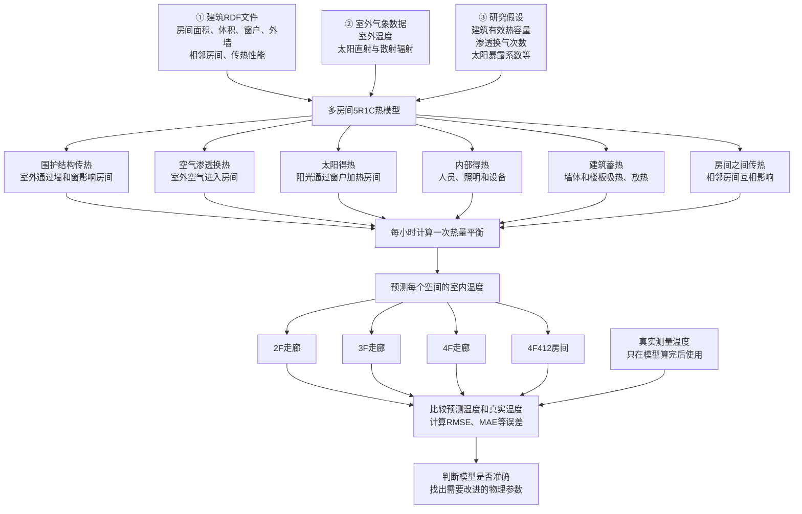
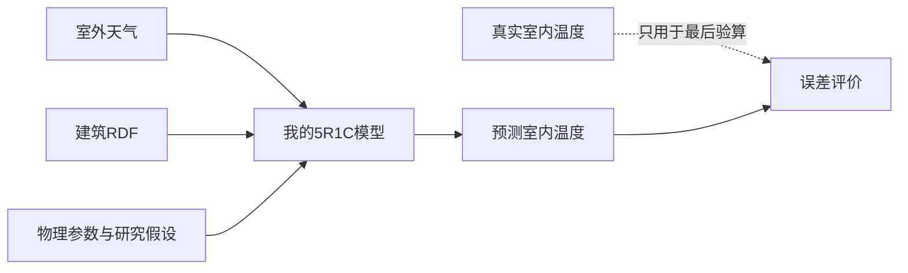
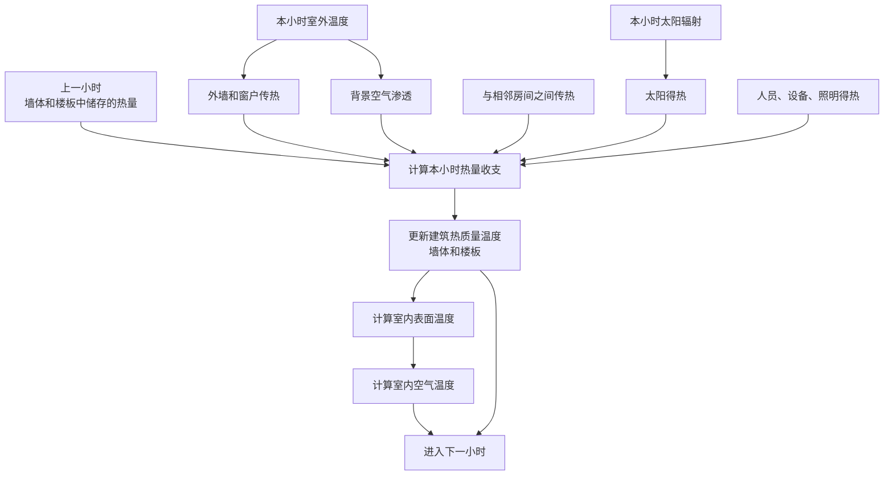
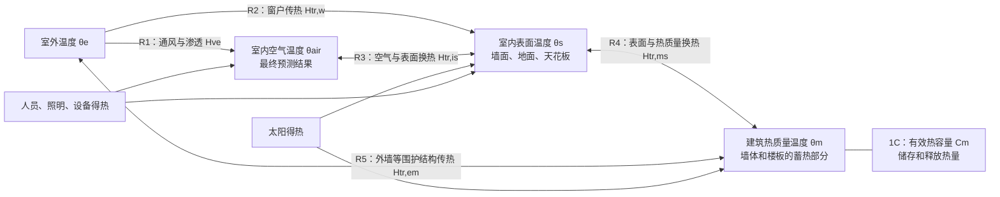
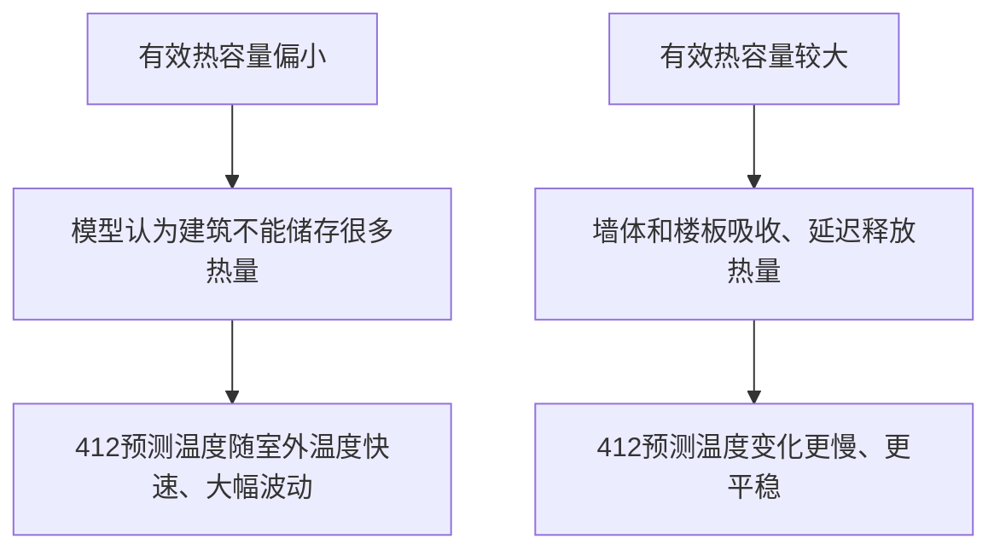
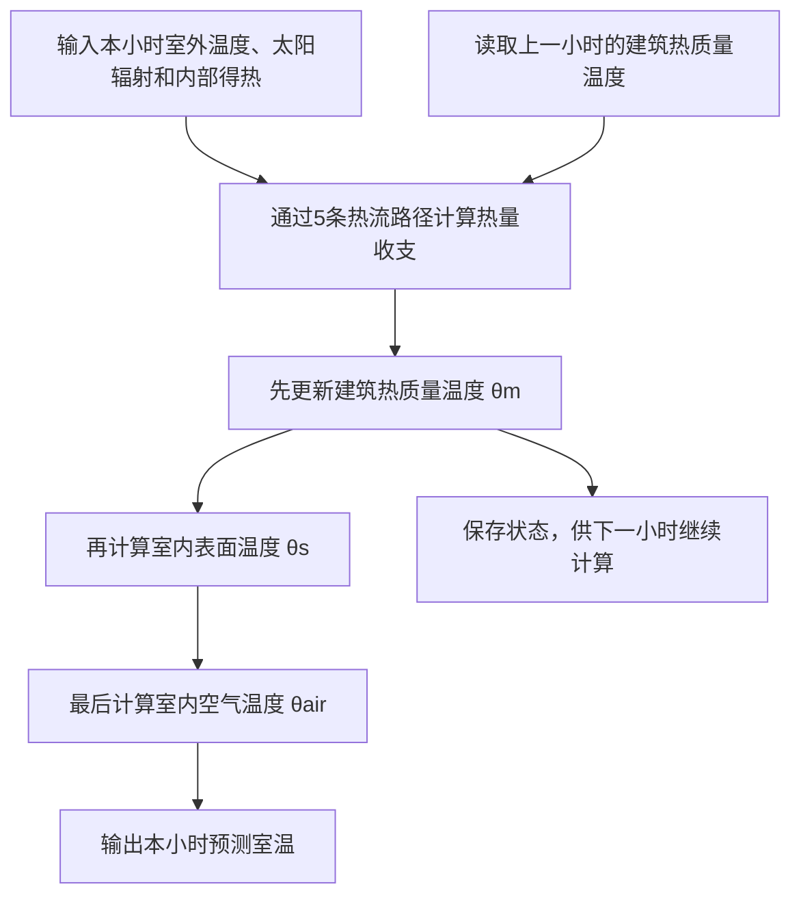
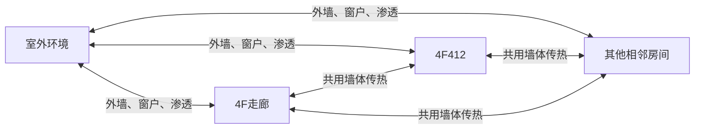
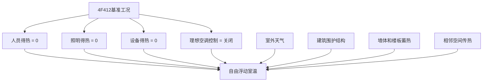
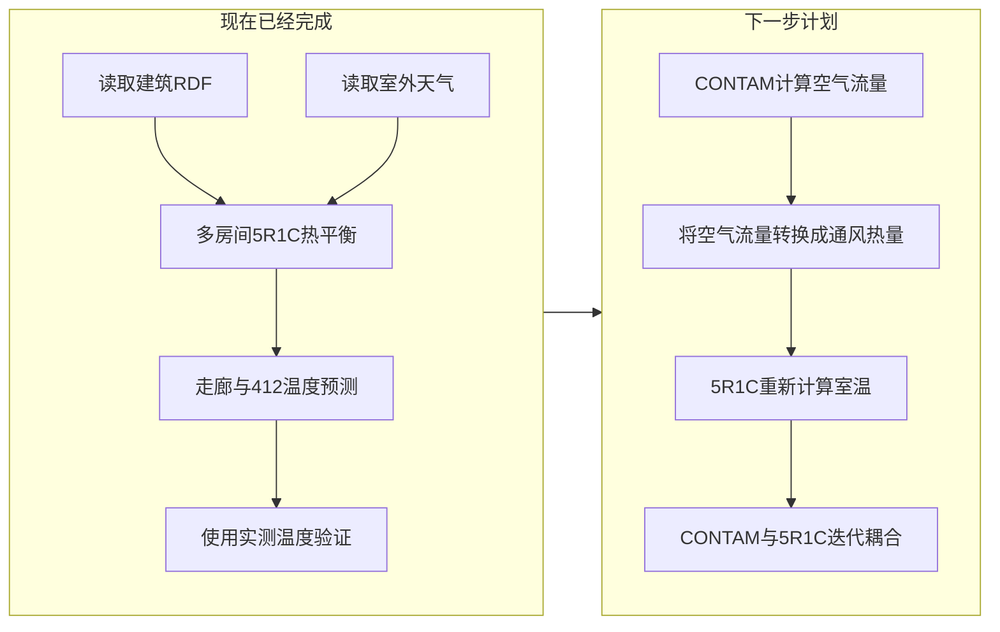

# 我的5R1C室温预测方法说明

## 一句话概括

> **只根据建筑本身的信息和室外天气，计算房间在没有空调控制时，室内温度会怎样自然变化；然后再拿真实温度检查计算得准不准。**

## 整体研究流程

最重要的一点是：

**真实室内温度没有进入模型。**

所以，我的研究不是：

> “根据过去的412温度，预测未来的412温度。”

而是：

> “在不知道412历史室温的情况下，只根据建筑和天气，计算412本来应该出现的自然室温。”

这就是这个模型最重要的研究价值。

## 模型每个小时具体做什么？

以4F412为例：

可以把它理解成记账：

> **房间温度变化 = 进入的热量 − 离开的热量 + 建筑储存或释放的热量**

模型每小时都做一次这样的“热量记账”。

## 5R1C模型本身是什么？

### 先理解R和C

5R1C是一种简化建筑热模型。它借用了电路的表达方式：

- **R是热阻（Thermal Resistance）**：表示热量通过一条路径有多困难。热阻越大，热量越难通过，保温效果越强。
- **C是热容量（Thermal Capacitance）**：表示墙体、楼板等建筑材料能够储存多少热量。热容量越大，温度变化越慢、越平稳。

可以用水来打比方：

- R像水管的阻力，决定水流得快不快；
- C像水箱的容量，决定能够存多少水；
- 温差像水压差，温差越大，热量流动的动力越强。

模型名称中的“5R”表示五条主要热量传递路径，“1C”表示一个主要的建筑蓄热节点。

### 五条热量传递路径

五条路径可以这样理解：

| 路径 | 模型中的名称 | 通俗解释 |
|---|---|---|
| R1 | 通风换热 `Hve` | 室外空气进入房间，带来冷量或热量 |
| R2 | 窗户传热 `Htr,w` | 热量直接通过窗户进出 |
| R3 | 空气—表面换热 `Htr,is` | 室内空气与墙面、地面、天花板交换热量 |
| R4 | 表面—热质量换热 `Htr,ms` | 室内表面把热量传给墙体和楼板的蓄热部分 |
| R5 | 热质量—室外换热 `Htr,em` | 墙体等围护结构与室外交换热量 |

代码中通常使用传热系数H，而不是直接保存热阻R。二者表达的是同一条热流路径的两个方向：

> **R越大，越不容易传热；H越大，越容易传热。**

### 为什么模型里有三个温度？

- **建筑热质量温度 θm**：代表墙体和楼板内部储存热量的状态。
- **室内表面温度 θs**：代表墙面、地面和天花板表面的平均温度。
- **室内空气温度 θair**：代表房间空气温度，也是最终与实测温度比较的结果。

三个温度不能完全看成同一个温度。例如，白天太阳照进房间后，墙面和楼板可以先吸热；夜间室外降温以后，它们再把热量释放出来。因此，空气温度不会立刻跟着室外温度同幅度变化。

### 1C为什么对412特别重要？

目前的敏感性分析发现，412的预测温度比实测温度波动更大，而且对室外温度反应过强。增大有效热容量后，412的预测明显改善。因此，当前最值得核实的参数之一，是墙体、楼板等材料共同形成的**有效热容量**。

但这并不意味着可以为了降低误差，直接把热容量任意调大。更可靠的做法是取得实际材料构造、厚度、密度和比热容，再计算每个空间对应的有效热容量。

### 5R1C每小时怎样得到一个室温？

因此，5R1C不是简单地给室外温度加减一个固定值。它会保留上一小时墙体和楼板的蓄热状态，所以具有时间上的连续性和热惯性。

## 为什么叫“多房间”模型？

我不是把412单独拿出来计算，而是把RDF里的多个空间放在同一个模型中一起计算。

因此：

- 室外会影响412；
- 相邻空间也会影响412；
- 412也会反过来影响相邻空间；
- 每个空间的温度需要联立计算，直到这一小时内的相邻温度关系稳定下来。

不过，**目前空间之间建模的是通过共用墙体的导热**。门窗开启造成的房间间空气流动，还没有由当前5R1C模型计算，这正是未来接入CONTAM的位置。

## 412在研究里有什么特殊之处？

412被设置成“无热扰基准房间”：

这意味着412的预测温度主要由以下因素决定：

- 室外温度；
- 太阳辐射；
- 外墙和窗户传热；
- 背景空气渗透；
- 相邻空间传热；
- 墙体和楼板的蓄热能力。

所以，412很适合用来检查模型的**建筑物理部分**是否正确。它不像办公室那样容易受到人员、电脑和空调运行的干扰。

但需要注意：目前只是把412的人员、照明、设备和理想空调设为零，**没有把RDF中的背景渗透换气自动设为零**。

## 目前已经做了什么，还没做什么？

目前还没有完成的主要部分是：

- 没有用CONTAM计算门、窗和房间之间的真实空气流动；
- 通风部分目前还是用背景渗透换气次数近似；
- 建筑有效热容量目前采用典型假设值，还没有根据项目真实材料逐层计算；
- 窗户方向虽然能从RDF读取，但目前太阳模型还没有真正按朝向计算；
- 一些参数仍然属于明确标注的研究假设，而不是项目实测资料。

## 给完全不了解这个研究的人怎么讲？

> 我的研究是在做一个建筑室温计算器。
>
> 我把建筑的房间大小、墙体、窗户、相邻关系，以及室外温度和太阳辐射输入模型。模型按照热量守恒，计算热量怎样通过墙、窗、空气和相邻房间进出，同时考虑墙体和楼板会储存热量，因此能够逐小时算出各个房间的自然室温。
>
> 在计算过程中，我不把真实室内温度提供给模型。等模型算完以后，我才用实际测量的走廊和412房间温度检查预测误差。因此，它不是依靠历史室温拟合出来的预测模型，而是一个基于建筑物理的设计阶段模型。
>
> 其中412没有人员、设备、照明和空调干扰，所以是最重要的基准房间。它可以帮助我判断模型里的墙体传热和建筑蓄热参数是否合理。未来我还会把模型和CONTAM连接起来，让CONTAM负责计算空气怎么流，我的模型负责计算这些空气流动最终会让室温变成多少。

## 汇报标题下的一句话

> **基于建筑RDF、室外气象与5R1C热平衡，在不使用历史室内温度的条件下，预测多空间自由浮动室温，并通过走廊与4F412实测温度进行验证。**
